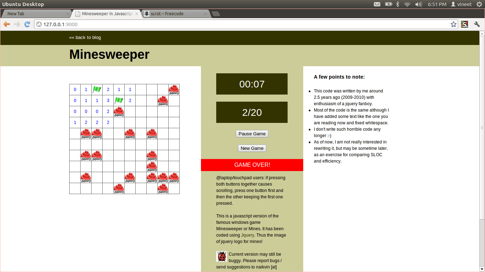

Mines
=====

What?
-----

Minesweeper written in Javascript using Jquery.

Points to note
--------------

- This code was written by me around 2.5 years ago
  (2009-2010) with enthusiasm of a jquery fanboy.
  I enjoyed and learnt a lot while writing this.

- Mines is `hosted here`_ but soon to be taken down, which is the
  reason for adding the code to github.

- Most of the code is the same although I have added some text like
  the one you are reading now and fixed whitespace.

- I don't write code as horrible as this one any longer ;-)

- Right now, I am not really interested in rewriting it, but may be
  sometime later, as an exercise for comparing SLOC and
  efficiency. OTOH, if anyone finds this interesting, just go for it!

To run this game, simply download this repo at a convenient location
on your desktop and open index.html in some browser.

Screenshot
----------

Todo
----

Host on github using gh-pages

.. _hosted here: http://vineetnaik.me/demo/index.php/mines

